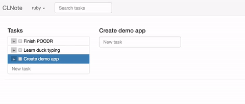

# clnote
A task manager built with clojure

**Create tasks**


**Add tasks to different collections**


**Create nested tasks**



**Drag tasks from one level to another**


**Mark tasks as completed**


** View all tasks together**


## Prerequisites

You will need [Leiningen][1] 2.0 or above installed.

[1]: https://github.com/technomancy/leiningen

## Running
### Setup
```sh
boot2docker up
```

```sh
lein run
```
